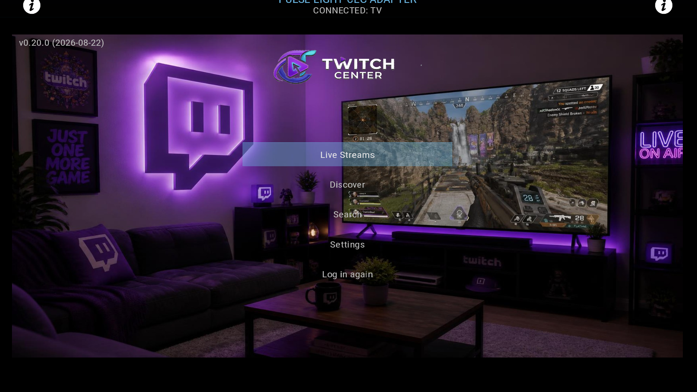
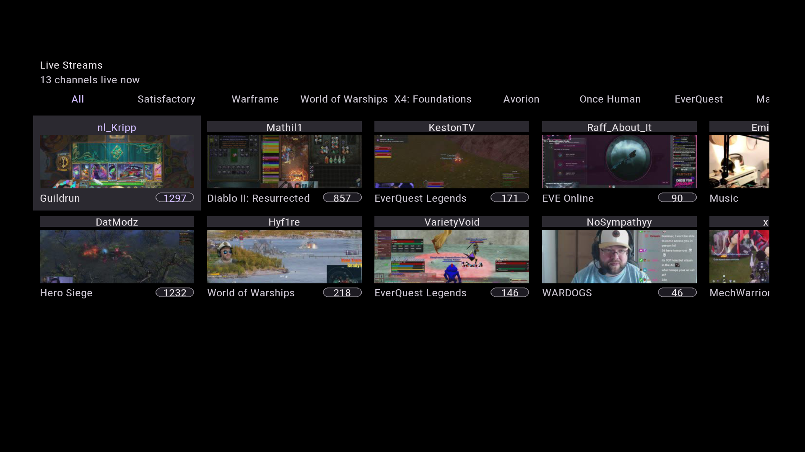
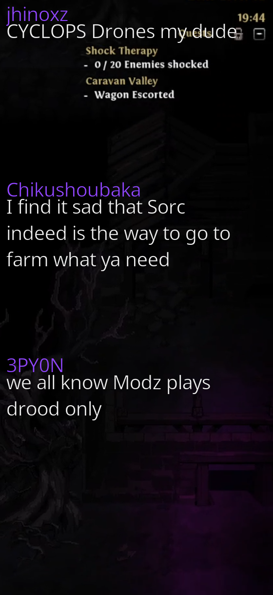

# Twitch Center

A Kodi program addon (`script.twitch.center`) for watching Twitch streams and reading their chat
from the couch: log in with your Twitch account, browse your followed/live channels or discover
new ones, and watch with an optional live chat overlay — all inside a custom, media-center-style
UI rather than Kodi's default skin listings.

Not designed for chatting *back* to the streamer — this is a second way to consume
streamer-generated content, not a chat client.

> **⚠️ Beta — working, but rough edges expected.** Core flows (login, browsing, playback, chat)
> are implemented, tested, and used daily on real hardware (desktop Kodi and a LibreELEC box), but
> this hasn't had wide testing across the range of devices/skins Kodi runs on. Expect occasional
> bugs, and please open an issue if you hit one. See [Status](#status) below for what's solid and
> what's still in progress.

## Screenshots



The landing screen after login — every other screen is one button away, no nested menus.



Your followed channels, live ones sorted to the front by viewer count, with a games/categories
filter row above the grid.



The optional chat overlay: connects automatically when a stream starts, auto-reconnects on drops,
and closes itself when the stream stops or ends.

## Features

- **Twitch login** via the official device-code flow (enter a short code on twitch.tv/activate —
  no password ever touches this addon).
- **Live Streams**: your followed channels, live ones first, sorted by viewer count, with a
  followed-games filter row.
- **Discover**: browse live channels by any game/category, or search by channel or game name.
- **Search**: free-text channel/stream search.
- **Playback** via `inputstream.adaptive` for proper adaptive-bitrate HLS, with automatic
  stall-recovery (re-resolves and restarts playback if a stream hiccups) and ad-break-aware
  recovery timing.
- **Chat overlay**: optional live chat panel next to the video, connects anonymously via IRC by
  default, or via Twitch's official EventSub API if you're logged in (Settings → Chat engine) —
  EventSub also unlocks a variable-height overlay that sizes each message box to its actual
  length instead of a fixed maximum.
- **Quit confirmation**, followed-games filtering, an optional "show offline channels" toggle, and
  a version/date label always visible in the corner so you know what build you're running.

## Installation

### Install via repository (recommended — enables auto-updates)

Twitch Center is distributed alongside other Kodi addons in the shared
[jellyfin-kodi-plex](https://github.com/drachenhort/jellyfin-kodi-plex) repository:

1. Download the repository addon zip:
   [`repository.jellyfinplex-1.0.1.zip`](https://drachenhort.github.io/jellyfin-kodi-plex/repository.jellyfinplex/repository.jellyfinplex-1.0.1.zip)
2. In Kodi: **Add-ons → Install from zip file**, select the downloaded file.
3. Then **Add-ons → Install from repository → Jellyfin (Plex-style) Repository →
   Program add-ons → Twitch Center**, and install it from there. (The repository is shared with
   an unrelated Jellyfin client addon — the name is a historical artifact, not a dependency.)

Kodi then checks the repository for new versions and can auto-update the addon like any other.

### Install from a plain zip (no auto-updates)

Download the addon zip from a
[jellyfin-kodi-plex Release](https://github.com/drachenhort/jellyfin-kodi-plex/releases) and use
**Add-ons → Install from zip file** in Kodi. You'll need to repeat this manually for every future
version.

## Status

**Working and used daily:** device-code Twitch login with transparent token refresh; Live
Streams (followed channels, live-first, viewer-count sorted, games filter); Discover (browse by
game, search by channel or game name); channel/stream search; HLS playback via
`inputstream.adaptive` with stall-recovery; the chat overlay (both IRC and EventSub engines,
including the variable-height EventSub-only rendering mode) with auto-reconnect and clean
teardown on stream end; a persistent single-window UI architecture that avoids a native Kodi
window-activation bug hit by the naive multi-window approach.

**In progress:** [Kick.com support](docs/kick-integration-notes.md) — the OAuth/API/stream-
resolution layer (`lib/kick/`) is built and fully unit-tested but not yet wired into the UI;
merging Kick channels into Live Streams/Discover/Search (unified, interleaved by viewer count) is
the next planned milestone. Kick chat is deliberately deferred until watching lands first.

**Known limitations:** anonymous IRC chat is the default chat engine (EventSub requires being
logged in, and isn't available for Search-result playback); no VOD/clips support (live streams
only); picture-in-picture (small video box beside chat/menus, rather than fullscreen-or-nothing)
is blocked on an unresolved Kodi playback-windowing question — see `TODO.md`.

See `CHANGELOG.md` for the full per-version history, and `docs/superpowers/specs`/
`docs/superpowers/plans` for design and implementation tracking on larger features.

## Development

```bash
pip install -r requirements-dev.txt
pytest
```

`lib/twitch/*` and `lib/kick/*` are pure-Python API/auth clients with no `xbmc*` imports, so
they're testable directly with pytest. `lib/windows/*` and `lib/views/*` are the layers that touch
`xbmcgui`/`xbmcaddon`/`xbmc`; `tests/kodi_stubs/` provides minimal stand-ins for those modules, so
this layer runs under plain pytest too — no real Kodi environment needed to exercise it.

To try it in Kodi: copy or symlink this directory into `~/.kodi/addons/script.twitch.center/` and
launch it from the Add-ons → Program add-ons menu.

## License

[MIT](LICENSE)
